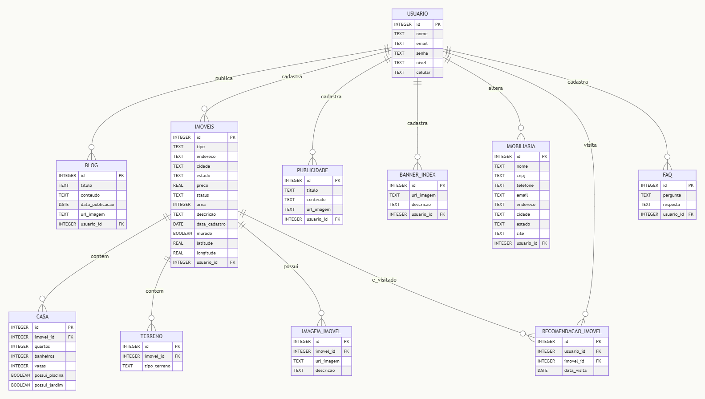

# Banco de dados (MySQL)

## Diagrama:


##  Ambientes

### 1. Produção
**Servidores da Faculdade**<br>
Strings de conexão:
```yaml
Em Desenvolvimento
```

### 2. Desenvolvimento
**AlwaysData**<br>
Strings de conexão:
```yaml
database: lp-imobiliaria_dev
host: mysql-lp-imobiliaria.alwaysdata.net
port: 3306
user: Utilizar o user disponibilizado pelo PM do seu produto
password: Utilizar a senha disponibilizada pelo PM do seu produto
```

### 3. Local
**Seu computador 😉**<br>

Para rodar localmente, basta criar um banco MySQL local e executar o script
[db_imobiliaria.sql](https://github.com/laboratorio-de-praticas-2025-2/banco-de-dados/blob/main/db_imobiliaria.sql) presente no repositório [laboratorio-de-praticas-2025-2/banco-de-dados](https://github.com/laboratorio-de-praticas-2025-2/banco-de-dados)
(Iremos mantê-lo atualizado caso ocorram mudanças)

## 📝 Recomendações Gerais:
- As estruturas e relações de tabelas deste banco **não devem ser alteradas** sem a autorização do time de dados.
- No ambiente de <i><b>desenvolvimento</b></i>, todos os usuários possuem acesso liberado para inserções e remoções de dados. Caso necessário, esses acessos poderão ser limitados...
- Recomendamos que o desenvolvimento seja iniciado sempre pelo banco local, pois ele oferece maior liberdade para testes e inserções de dados, menor latência nas consultas e a possibilidade de trabalhar com dados inconsistentes ou incompletos sem impacto no ambiente principal ou de desenvolvimento.

## Exemplos de Conexão no banco de Desenvolvimento (HeidiSQL):

