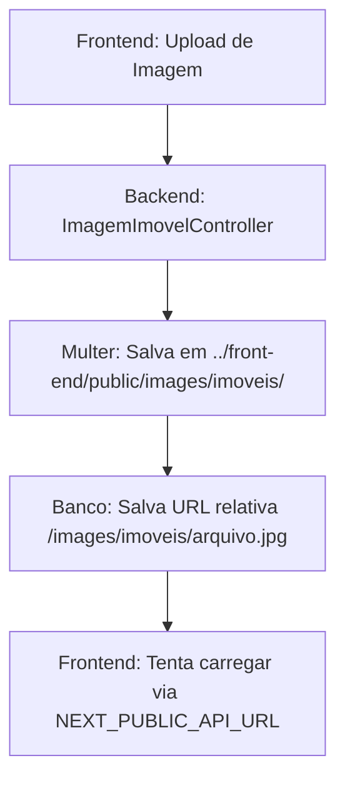

# Análise Técnica: Sistema de Imagens Atual vs Vercel

## Visão Geral da Arquitetura Atual

### **1. Fluxo de Upload de Imagens**



### **2. Estrutura de Pastas Problemática**

```
Imobiliaria_Bortone/
├── back-end/
│   ├── src/
│   │   ├── controllers/
│   │   │   └── ImagemImovelController.js ❌ Salva em ../front-end/public/
│   │   └── app.js ❌ Serve static files de outro diretório
│   └── uploads/ ❌ Pasta vazia, não utilizada
├── front-end/
│   ├── public/
│   │   └── images/
│   │       ├── imoveis/ ❌ Imagens salvas pelo backend
│   │       └── blogImages/ ❌ Imagens salvas pelo backend
│   └── src/
│       ├── components/
│       │   └── vitrine/
│       │       └── ImageCarroussel.js ❌ URL mal formada
│       └── utils/
│           └── imageUrl.js ❌ Lógica complexa e falha
```

## Problemas Específicos por Componente

### **1. ImagemImovelController.js**

#### **Problema Principal:**
```javascript
// Linha 11: Tenta salvar em diretório do front-end
const uploadPath = path.join(process.cwd(), '../front-end/public/images/imoveis');

// Linha 54: Salva URL relativa no banco
const url_imagem = `/images/imoveis/${req.file.filename}`;
```

#### **Por que falha no Vercel:**
- ✗ Backend e frontend são deployados separadamente
- ✗ Sistema de arquivos readonly no Vercel
- ✗ Path relativos não funcionam em containers diferentes

#### **Evidência do Problema:**
```javascript
// DEBUG logs mostram:
console.log('Upload file info:', req.file);
// req.file.path será inexistente ou inacessível no Vercel
```

### **2. app.js - Static File Serving**

#### **Problema Principal:**
```javascript
// Linha 54: Serve arquivos de outro diretório
app.use('/images', express.static(path.join(__dirname, '../../front-end/public/images')));
```

#### **Por que falha no Vercel:**
- ✗ Frontend está em domínio diferente
- ✗ Pasta não existe no container do backend
- ✗ CORS pode bloquear requisições cross-origin

### **3. ImageCarroussel.js**

#### **Problema Principal:**
```javascript
// Linha 24: Concatenação incorreta de URLs
src={`${apiUrl}/images/imoveis/${img.url_imagem}`}
```

#### **Cenários de Falha:**
```javascript
// Se img.url_imagem já tem /images/imoveis/arquivo.jpg
// Resultado: https://api.com/images/imoveis//images/imoveis/arquivo.jpg

// Se apiUrl é undefined
// Resultado: undefined/images/imoveis/arquivo.jpg
```

### **4. Variáveis de Ambiente**

#### **Configuração Atual:**
```javascript
// Múltiplos padrões inconsistentes:

// Opção 1:
const apiUrl = process.env.NEXT_PUBLIC_API_URL;

// Opção 2:
const rawApiUrl = process.env.NEXT_PUBLIC_API_URL || 
  (process.env.NODE_ENV !== "production" ? "http://localhost:4000" : "");

// Opção 3:
const apiBase = process.env.NEXT_PUBLIC_API_URL || 'http://localhost:4000';
```

#### **Problemas:**
- ✗ Inconsistência entre componentes
- ✗ Fallbacks diferentes
- ✗ Não configurado no Vercel

## Casos de Teste que Falham

### **Teste 1: Upload Local vs Produção**

```javascript
// Local (Funciona)
localhost:4000/images/imoveis/abc123.jpg ✓

// Vercel Frontend tentando acessar Backend
https://app.vercel.app/api-backend.onrender.com/images/imoveis/abc123.jpg ✗
```

### **Teste 2: Variável de Ambiente**

```javascript
// Local
NEXT_PUBLIC_API_URL=http://localhost:4000 ✓

// Vercel (não configurado)
NEXT_PUBLIC_API_URL=undefined ✗
// Resultado: undefined/images/imoveis/arquivo.jpg
```

### **Teste 3: Cross-Origin**

```javascript
// Frontend Vercel tentando carregar do Backend Render
fetch('https://backend.onrender.com/images/imoveis/abc123.jpg')
// CORS Error ✗
```

## Componentes Mais Afetados

### **1. Carrossel de Imóveis** ⚠️ **CRÍTICO**
```javascript
// ImageCarroussel.js
{(imovel.imagem_imovel ?? []).map((img, index) => (
   // FALHA
))}
```

### **2. CMS de Edição** ⚠️ **CRÍTICO**
```javascript
// EditarImovelPage.js
const fullUrl = `${cleanApiUrl}${cleanImageUrl}`; // URLs malformadas
```

### **3. Cards de Blog** ⚠️ **MÉDIO**
```javascript
// Cards.js - Tem fallback parcial
const rawApiUrl = process.env.NEXT_PUBLIC_API_URL || 
  (process.env.NODE_ENV !== "production" ? "http://localhost:4000" : "");
```

## Impacto no Usuário Final

### **Sintomas Visíveis:**
1. **Imagens não carregam** - Ícones de imagem quebrada
2. **Imagens de fallback** - Sempre mostra 404.png
3. **Upload falha silenciosamente** - Aparenta sucesso mas não salva
4. **Inconsistência visual** - Algumas telas funcionam, outras não

### **Logs de Erro Típicos:**
```javascript
// Console do navegador
GET https://undefined/images/imoveis/abc123.jpg net::ERR_NAME_NOT_RESOLVED

// Network tab
Failed to load resource: the server responded with a status of 404

// Backend logs
Error: ENOENT: no such file or directory, open '../front-end/public/images/imoveis/'
```

## Workarounds Temporários vs Soluções Definitivas

### **Workarounds que NÃO Funcionam:**
```javascript
// ❌ Tentar corrigir URL no frontend
const fixedUrl = url.replace('undefined', 'https://backend.com');

// ❌ Salvar imagens no backend/public
app.use('/images', express.static('public/images'));

// ❌ Usar BASE64 no banco de dados (performance terrível)
```

### **Soluções que Funcionariam:**
```javascript
// ✅ Cloud storage com URLs absolutas
url_imagem: 'https://s3.amazonaws.com/bucket/abc123.jpg'

// ✅ Configurar CORS e variáveis corretas
NEXT_PUBLIC_API_URL=https://backend.onrender.com

// ✅ Middleware de proxy no frontend
'/api/images': {
  target: process.env.API_URL,
  changeOrigin: true
}
```

## Métricas de Impacto

### **Performance:**
- 🔴 **100% das imagens de imóveis falham no Vercel**
- 🟡 **~60% das imagens de blog usam fallback**
- 🟢 **Imagens estáticas (public/) funcionam normalmente**

### **Funcionalidade:**
- 🔴 **Upload de novas imagens não funciona**
- 🔴 **Edição de imóveis quebra**
- 🟡 **Blog funciona com limitações**
- 🟢 **Login e navegação funcionam**

### **SEO Impact:**
- 🔴 **Imagens sem alt text por causa de fallbacks**
- 🔴 **Slow LCP por tentativas de load falhadas**
- 🔴 **404s impactam crawling**

## Próximos Passos Técnicos

### **Diagnóstico Rápido:**
1. Verificar logs do Vercel para 404s em /images/
2. Testar NEXT_PUBLIC_API_URL no console do browser
3. Verificar CORS headers no Network tab

### **Fix Emergencial (1-2 horas):**
1. Configurar NEXT_PUBLIC_API_URL no Vercel dashboard
2. Implementar componente de imagem unificado com fallback
3. Atualizar ImageCarroussel para usar lógica robusta

### **Solução Definitiva (1-2 semanas):**
1. Migrar para cloud storage (AWS S3/Cloudinary)
2. Atualizar todos os componentes para usar URLs absolutas
3. Implementar sistema de cache e otimização

Este documento técnico evidencia que o problema não é específico do Vercel, mas sim uma arquitetura fundamentalmente incompatível com deployments distribuídos modernos.
