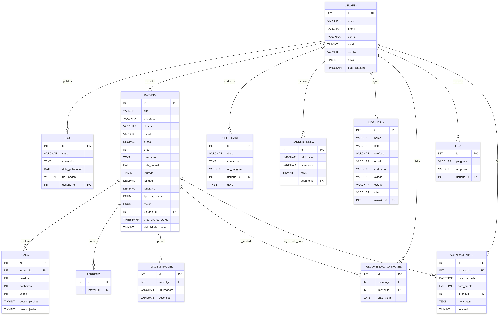
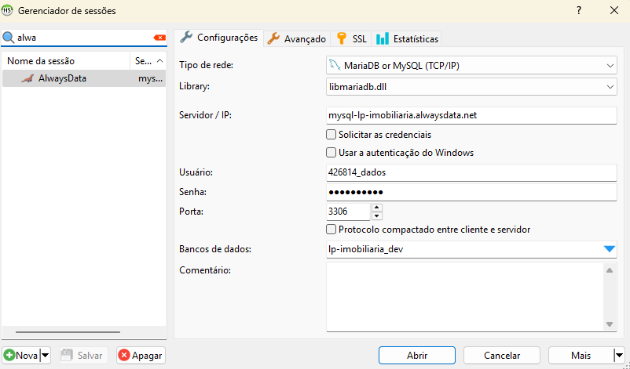
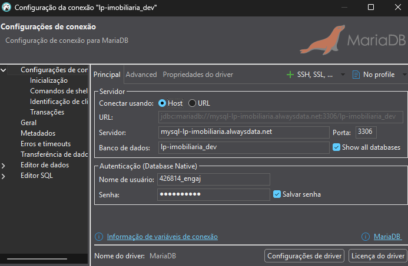
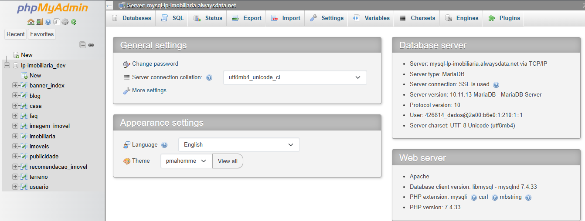

# Banco de dados (MySQL)

## 📝 Recomendações Gerais:
- As estruturas e relações de tabelas deste banco **não devem ser alteradas** sem a autorização do time de dados.
- No ambiente de <i><b>desenvolvimento</b></i>, todos os usuários possuem acesso liberado para inserções e remoções de dados. Caso necessário, esses acessos poderão ser limitados...
- Recomendamos que o desenvolvimento seja iniciado sempre pelo banco local, pois ele oferece maior liberdade para testes e inserções de dados, menor latência nas consultas e a possibilidade de trabalhar com dados inconsistentes ou incompletos sem impacto no ambiente principal ou de desenvolvimento.

## Versões
- O banco de dados em produção está rodando na versão ```10.11.13-MariaDB```.

- ⚠️ Atenção: ao executar queries localmente, podem surgir erros ou alertas caso a versão MySQL/MariaDB utilizada no ambiente local seja mais recente do que a versão do banco hospedado. Isso acontece devido a diferenças de sintaxe, funções e comportamentos entre versões distintas dos SGBDs. Sugerimos 

## Últimas Mudanças 

- Adição do atributo *data_cadastro* na tabela *usuario*
- Adição de tabela *agendamentos*
- Adição de views e procedures para time de Dashboard e Reports

## Diagrama:


## Estrutura:


??? note "USUARIO"
    | Nome da Coluna | Tipo de Dado                      | Descrição                          |
    | -------------- | --------------------------------- | ---------------------------------- |
    | id             | INT(11)                           | Identificador único do usuário     |
    | nome           | VARCHAR(100)                      | Nome completo do usuário           |
    | email          | VARCHAR(100)                      | E-mail do usuário (deve ser único) |
    | senha          | VARCHAR(255)                      | Senha criptografada                |
    | nivel          | TINYINT(1)                        | Nível de acesso do usuário, 0 = administrador, 1 = visitante |
    | celular        | VARCHAR(20)                       | Número de celular do usuário       |
    | ativo          | TINYINT(1)                        | Status do usuário (0 = inativo, 1 = ativo) |
    | data_cadastro  | TIMESTAMP                         | Data de cadastro (UTC)             |


*Tabela para armazenar os dados de um usuário cadastrado.*


??? note "IMOVEIS"

    | Nome da Coluna | Tipo de Dado       | Descrição                                |
    |---------------|--------------------|-------------------------------------------|
    | id            | INT(11)           | Identificador único do imóvel            |
    | tipo          | VARCHAR(50)       | Tipo do imóvel (ex.: Casa, Apartamento ou Terreno)  |
    | endereco      | VARCHAR(255)      | Endereço do imóvel (ex: Número, rua, bairro) |
    | cidade        | VARCHAR(100)      | Cidade onde o imóvel está localizado     |
    | estado        | VARCHAR(2)        | Sigla do estado                          |
    | preco         | DECIMAL(12,2)     | Preço do imóvel                          |
    | status        | ENUM('disponivel', 'indisponivel', 'vendido', 'locado')       | Status do imóvel, esse campo pode ser usado para lógica de mostrar ou não o imóvel no site/mapa |
    | area          | INT(11)           | Área do imóvel em m²                     |
    | descricao     | TEXT              | Descrição do imóvel                      |
    | data_cadastro | DATE              | Data de cadastro do imóvel               |
    | murado        | TINYINT(1)        | Indica se o imóvel é murado (0 = não, 1 = sim)    |
    | latitude      | DECIMAL(10,7)     | Latitude da localização                  |
    | longitude     | DECIMAL(10,7)     | Longitude da localização                 |
    | usuario_id    | INT(11)           | ID do usuário que cadastrou o imóvel (Apenas administradores cadastram imóveis)    |
    | tipo_negociacao     | ENUM('venda', 'aluguel') | Tipo de proposta do imóvel (Está disponível para venda ou aluguel) - Em caso de um imóvel ser oferecido como ambas opções deve-se cadastrar duas vezes e conectá-lo com a mesma tabela de casa ou de terreno |
    | data_update_status  | TIMESTAMP | Campo guarda a data da ocorrência de update no atributo status do imóvel. Exemplo: Ao atualizar para "vendido" vai ficar registrado que foi vendido no dia do update, o mesmo funciona se mudar para locado, disponivel ou indisponivel (A atualização do campo DATA_UPDATE_STATUS é feita de forma automática no banco por meio de um trigger que observa o campo STATUS) |
    | visibilidade_preco | TINYINT(1) | Exibição do preço (0 = oculto, 1 = visível) |


*Tabela para armazenar os dados dos imóveis cadastrados*


??? note "CASA"

    | Nome da Coluna   | Tipo de Dado   | Descrição                                |
    |-----------------|----------------|-------------------------------------------|
    | id              | INT(11)       | Identificador único da casa              |
    | imovel_id       | INT(11)       | ID do imóvel relacionado                 |
    | quartos         | INT(11)       | Número de quartos                        |
    | banheiros       | INT(11)       | Número de banheiros                      |
    | vagas           | INT(11)       | Número de vagas de garagem               |
    | possui_piscina  | TINYINT(1)    | Indica se a casa possui piscina (0 = não, 1 = sim)|
    | possui_jardim   | TINYINT(1)    | Indica se a casa possui jardim (0 = não, 1 = sim) |


*Tabela para armazenar os dados do imóvel quando for casa*


??? note "TERRENO"

    | Nome da Coluna | Tipo de Dado | Descrição                           |
    |----------------|--------------|-------------------------------------|
    | id             | INT(11)      | Identificador único do terreno      |
    | imovel_id      | INT(11)      | ID do imóvel relacionado            |


*Tabela para armazenar os dados do imóvel quando for terreno*


??? note "IMAGEM_IMOVEL"

    | Nome da Coluna | Tipo de Dado   | Descrição                           |
    |----------------|----------------|-------------------------------------|
    | id             | INT(11)        | Identificador único da imagem       |
    | imovel_id      | INT(11)        | ID do imóvel relacionado            |
    | url_imagem     | VARCHAR(255)   | Nome da Imagem + extensão (ex: 7ac66c0f1484d64.png) - Deve-se usar um algoritmo de hash (ex: MD5) para garantir que os nomes de imagens não sejam iguais no momento de salvar - As imagens serão guardadas em um mesmo diretório, o banco só guarda o nome único hasheado e o caminho padrão ficará definido no back-end |
    | descricao      | VARCHAR(255)   | Descrição da imagem                 |


*Tabela para armazenar cada imagem do imóvel*


??? note "BANNER_INDEX"

    | Nome da Coluna | Tipo de Dado    | Descrição                          |
    |----------------|----------------|-------------------------------------|
    | id             | INT(11)        | Identificador único                 |
    | url_imagem     | VARCHAR(255)   | Nome da Imagem + extensão (ex: 7ac66c0f1484d64.png) - Deve-se usar um algoritmo de hash (ex: MD5) para garantir que os nomes de imagens não sejam iguais no momento de salvar - As imagens serão guardadas em um mesmo diretório, o banco só guarda o nome único hasheado e o caminho padrão ficará definido no back-end                       |
    | descricao      | VARCHAR(255)   | Descrição                           |
    | usuario_id     | INT(11)        | ID do usuário que cadastrou o banner (Apenas administradores podem cadastrar)|
    | ativo          | TINYINT(1)     | Indica se o banner deve aparecer ou não no carrossel da página (0 = não, 1 = sim) |


*Tabela para armazenar imagens do carrosel*


??? note "IMOBILIARIA"

    | Nome da Coluna | Tipo de Dado    | Descrição                             |
    |----------------|----------------|---------------------------------------|
    | id             | INT(11)        | Identificador único                   |
    | nome           | VARCHAR(100)   | Nome da imobiliária                   |
    | cnpj           | VARCHAR(20)    | CNPJ da imobiliária                   |
    | telefone       | VARCHAR(20)    | Telefone de contato                   |
    | email          | VARCHAR(100)   | E-mail de contato                     |
    | endereco       | VARCHAR(255)   | Endereço                              |
    | cidade         | VARCHAR(100)   | Cidade                                |
    | estado         | VARCHAR(2)     | Estado (sigla)                        |
    | site           | VARCHAR(100)   | Url do Website da imobiliária         |
    | usuario_id     | INT(11)        | ID do usuário responsável (Apenas usuário do tipo administrador pode alterar)             |

*Tabela para armazenar os dados da imobiliária (Apenas um dado deve ser cadastrado nessa tabela)*


??? note "FAQ"

    | Nome da Coluna | Tipo de Dado | Descrição                           |
    |----------------|--------------|-------------------------------------|
    | id             | INT(11)      | Identificador único da pergunta     |
    | pergunta       | TEXT         | Dúvida                         |
    | resposta       | TEXT         | Resposta      |
    | usuario_id     | INT(11)      | ID do usuário Responsável (Apenas Administradores podem cadastrar as perguntas e respostas)  |


*Tabela para armazenar os dados das perguntas e respostas*


??? note "RECOMENDACAO_IMOVEL"

    | Nome da Coluna | Tipo de Dado | Descrição                           |
    |----------------|--------------|-------------------------------------|
    | id             | INT(11)      | Identificador único da recomendação |
    | usuario_id     | INT(11)      | ID do usuário que recebeu a recomendação |
    | imovel_id      | INT(11)      | ID do imóvel recomendado            |
    | data_visita    | DATE         | Data da visita na página do imóvel  |


*Tabela para armazenar os dados referentes aos acessos do usuário*
- Ao acessar a página de determinado imóvel o dado será salvo nessa tabela, esse "histórico" de acesso é usado no algoritmo de recomendação.


??? note "PUBLICIDADE"

    | Nome da Coluna | Tipo de Dado  | Descrição                           |
    |----------------|---------------|-------------------------------------|
    | id             | INT(11)       | Identificador único da publicidade  |
    | titulo         | VARCHAR(100)  | Título da publicidade               |
    | conteudo       | TEXT          | Conteúdo da publicidade             |
    | url_imagem     | VARCHAR(255)  | Nome da Imagem + extensão (ex: 7ac66c0f1484d64.png) - Deve-se usar um algoritmo de hash (ex: MD5) para garantir que os nomes de imagens não sejam iguais no momento de salvar - As imagens serão guardadas em um mesmo diretório, o banco só guarda o nome único hasheado e o caminho padrão ficará definido no back-end |
    | usuario_id     | INT(11)       | ID do usuário que cadastrou a publicidade |
    | ativo          | TINYINT(1)     | Indica se a publicidade está ativa e deve aparecer no site (0 = não, 1 = sim) |

*Tabela para armazenar publicidades*


- Exemplo de caso relacionado com essa tabela: Uma loja de móveis fez um acordo para publicidade com a imobiliária, então o administrador cadastra os dados relacionados a propaganda e então as publicidades cadastradas aparecem no front


??? note "BLOG"

    | Nome da Coluna    | Tipo de Dado   | Descrição                              |
    |------------------|----------------|-------------------------------------    |
    | id               | INT(11)       | Identificador único do post              |
    | titulo           | VARCHAR(100)  | Título do post                           |
    | conteudo         | TEXT          | Conteúdo do post                         |
    | data_publicacao  | DATE          | Data de publicação do post               |
    | url_imagem       | VARCHAR(255)  | Nome da Imagem associada ao post + extensão (ex: 7ac66c0f1484d64.png) - Apenas uma imagem para cada post no blog! - Deve-se usar um algoritmo de hash (ex: MD5) para garantir que os nomes de imagens não sejam iguais no momento de salvar - As imagens serão guardadas em um mesmo diretório, o banco só guarda o nome único hasheado e o caminho padrão ficará definido no back-end          |
    | usuario_id       | INT(11)       | ID do usuário que publicou a postagem    |


*Tabela para armazenar as postagens do blog*

??? note "AGENDAMENTOS"

    | Nome da Coluna | Tipo de Dado | Descrição |
    |----------------|--------------|-----------|
    | id | INT(11) | Identificador único do agendamento |
    | id_usuario | INT(11) | ID do usuário que fez o agendamento |
    | data_marcada | DATETIME | Data e hora marcada para o agendamento |
    | data_create | DATETIME | Data de criação do agendamento (automática) |
    | id_imovel | INT(11) | ID do imóvel relacionado ao agendamento |
    | mensagem | TEXT | Mensagem adicional do usuário |
    | concluido | TINYINT(1) | Status do agendamento (0 = não concluído, 1 = concluído) |


*Tabela para armazenar os agendamentos e interesses de agendamentos*

## Ambientes

### 1. Produção
Solução de hospedagem: **AlwaysData**<br>
Strings de conexão 🚨(Acesso Restrito):
```yaml
database: lpbortone_bd_prod
host: mysql-lpbortone.alwaysdata.net
port: 3306
```

### 2. Desenvolvimento
Solução de hospedagem: **AlwaysData**<br>
Strings de conexão:
```yaml
database: lp-imobiliaria_dev
host: mysql-lp-imobiliaria.alwaysdata.net
port: 3306
user: Utilizar o user disponibilizado pelo PM do seu produto
password: Utilizar a senha disponibilizada pelo PM do seu produto
```

### 3. Local
**Seu computador 😉**<br>

Para rodar localmente, basta criar um banco MySQL local e executar o script
[db_imobiliaria_Vx_x.sql] presente no repositório [laboratorio-de-praticas-2025-2/banco-de-dados](https://github.com/laboratorio-de-praticas-2025-2/banco-de-dados)
(Iremos mantê-lo atualizado caso ocorram mudanças)

## Maneiras de se conectar e visualizar os dados:
### 1. Utilizando um Software de gerenciamento de Banco de dados (HeidiSQL, Dbeaver, MySQL Workbench....):
#### HeidiSQL:

#### Dbeaver:

### 2. Utilizando o phpMyAdmin pela web:
<strong>Link: [phpmyadmin](https://phpmyadmin.alwaysdata.com/)</strong> <br>
```yaml
MySQL user: Utilizar o user disponibilizado pelo PM do seu produto
Password: Utilizar a senha disponibilizada pelo PM do seu produto
```



### 3. Pelo código em uma aplicação backend utilizando as credenciais de acesso fornecidas