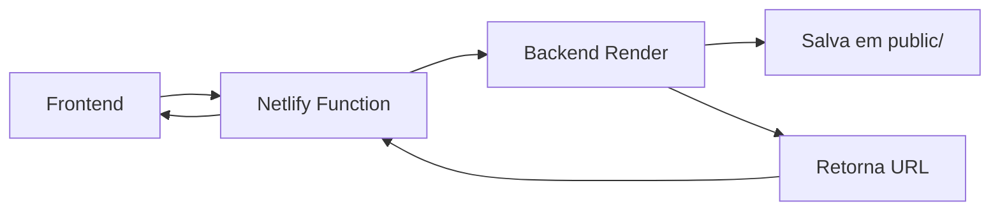

# 🚨 Problema: Imagens não aparecem no Netlify

## 🔍 **Diagnóstico do Problema**

### **Por que as imagens não funcionam:**

1. **Netlify Functions é Read-Only** 
   - ❌ Não pode salvar arquivos em `public/` durante runtime
   - ❌ Sistema de arquivos é somente leitura após build
   - ❌ Tentativa de `fs.copyFile()` falha silenciosamente

2. **Arquitetura Incorreta**
   - ❌ Frontend tentando salvar imagens localmente
   - ❌ Sem integração com backend para persistência
   - ❌ URLs apontando para arquivos inexistentes

## ✅ **Solução Implementada**

### **Nova Arquitetura: Proxy para Backend**



### **Como funciona agora:**

1. **Frontend** envia imagem para `/.netlify/functions/upload-image`
2. **Netlify Function** faz proxy para backend no Render
3. **Backend** salva imagem e retorna URL completa
4. **Frontend** recebe URL e pode exibir imagem

## 📋 **Arquivos Modificados**

### **1. `netlify/functions/upload-image.js`**
```javascript
// ❌ ANTES: Tentava salvar localmente
await fs.copyFile(uploadedFile.path, destinationPath);

// ✅ AGORA: Proxy para backend
const response = await fetch(`${backendUrl}/imagemImovel/upload`, {
  method: 'POST',
  body: formData
});
```

### **2. `services/netlifyUploadService.js`**  
```javascript
// ✅ Atualizado para trabalhar com novo proxy
export const uploadToNetlify = async (file, imovelId, descricao) => {
  // Envia para Netlify Function que faz proxy para backend
}
```

### **3. Dependências Adicionadas**
```json
{
  "form-data": "^4.0.0",
  "node-fetch": "^2.7.0"
}
```

## 🧪 **Como Testar**

### **1. Página de Teste Criada:**
- Acesse: `https://seu-site.netlify.app/test-upload`
- Faça upload de uma imagem
- Verifique logs no console (F12)

### **2. Logs de Debug:**
```javascript
// Netlify Function logs
console.log('🔍 NETLIFY FUNCTION DEBUG:');
console.log('🌐 Fazendo proxy para backend:', backendUrl);
console.log('✅ Upload bem-sucedido:', result);
```

### **3. Verificar Variáveis de Ambiente:**
```bash
# No painel do Netlify, conferir:
NEXT_PUBLIC_API_URL=https://seu-backend.onrender.com
```

## 🔧 **Troubleshooting**

### **Problema: Upload falha com erro 500**
```javascript
// Causa: NEXT_PUBLIC_API_URL não configurada
❌ Error: Variável de ambiente NEXT_PUBLIC_API_URL não configurada

// Solução: Configurar no painel do Netlify
✅ Site settings > Environment variables > Add variable
```

### **Problema: Network Error**
```javascript
// Causa: Backend offline ou URL incorreta
❌ TypeError: fetch failed

// Solução: Verificar se backend está rodando
✅ Testar: https://seu-backend.onrender.com/health
```

### **Problema: CORS Error**
```javascript
// Causa: Backend não configurado para aceitar Netlify
❌ Access to fetch blocked by CORS policy

// Solução: Atualizar CORS no backend
✅ app.use(cors({ origin: ['https://seu-site.netlify.app'] }))
```

### **Problema: Imagem não carrega após upload**
```javascript
// Causa: URL retornada incorreta
❌ result.url = "/images/imoveis/arquivo.jpg" (relativa)

// Solução: Backend retornar URL completa
✅ result.url = "https://backend.com/images/imoveis/arquivo.jpg"
```

## 📈 **Próximos Passos**

### **1. Testar Upload (AGORA):**
```bash
# Commit e push das alterações
git add .
git commit -m "fix: Netlify image upload via backend proxy"
git push origin main

# Testar na página: /test-upload
```

### **2. Configurar Variáveis de Ambiente:**
- `NEXT_PUBLIC_API_URL` = URL do seu backend
- Verificar se backend está acessível
- Testar endpoint `/imagemImovel/upload`

### **3. Integrar com Componentes Existentes:**
- Atualizar `UploadImovel.js`
- Atualizar `ImageCarroussel.js`
- Usar `uploadToNetlify()` em vez de upload direto

## ✅ **Resultado Esperado**

Após as correções:
- ✅ Upload funciona via Netlify Function
- ✅ Imagens são salvas no backend (Render)
- ✅ URLs completas retornadas
- ✅ Imagens carregam corretamente no frontend

**🚀 Faça o commit e teste em `/test-upload`!**
